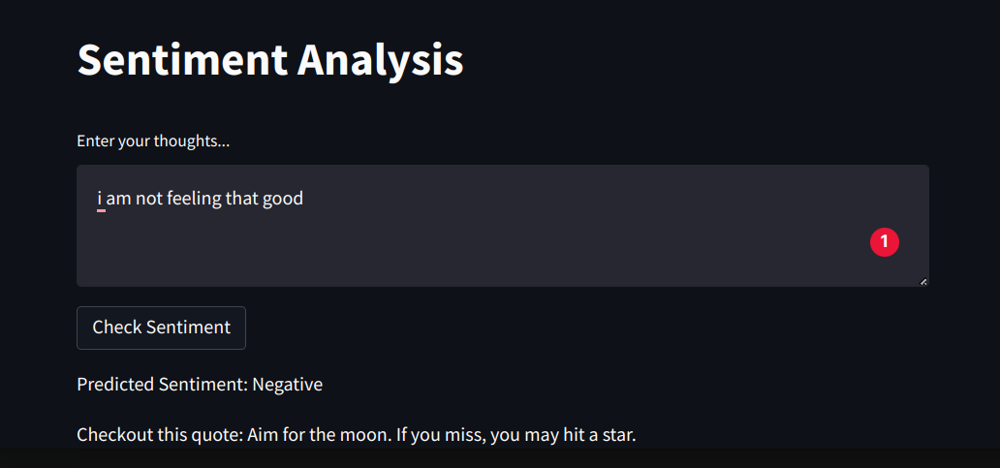

# Sentiment Analysis API

This repo contains inference setup for Sentiment Analysis Api created with Fast Api

## Docker Setup
To create a container use the following commands
```
docker-compose build
docker-compose up
```

After the above commands have been run the API backend will run at [http://localhost:8080/api](http://localhost:8080/api)
and the frontend can be reached at [http://localhost/](http://localhost)



## Usage:

The API can used to get a json response containing sentiment of a query text passed through parameter 'text' in a get request.

### HTTP:
```
http://< endpoint address with port number >/api/?text="< text to be classified >"
```
### Python Requests:
```
import requests

r = requests.get("http://< endpoint address with port number >/api/?text="< text to be classified >")
print(r.json())

```

## Frontend

You can maually specify an API address and port number using `API_ADDRESS` and `API_PORT` environment variables respectively.